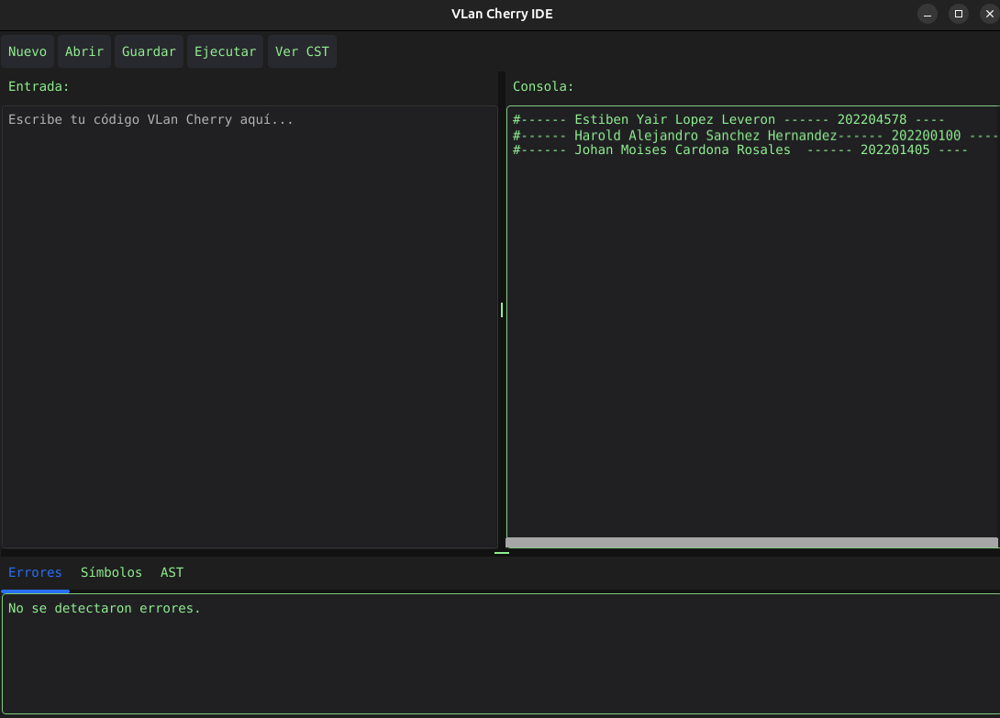
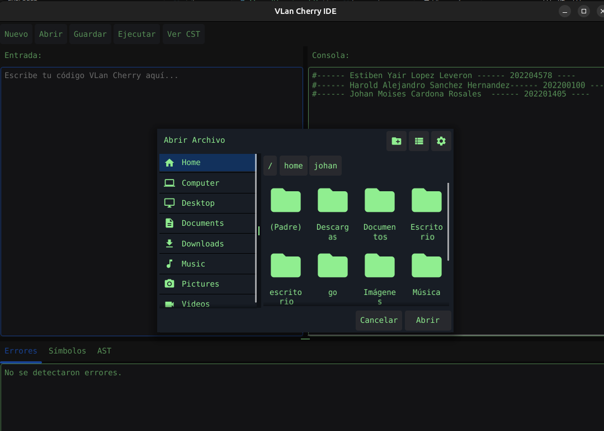
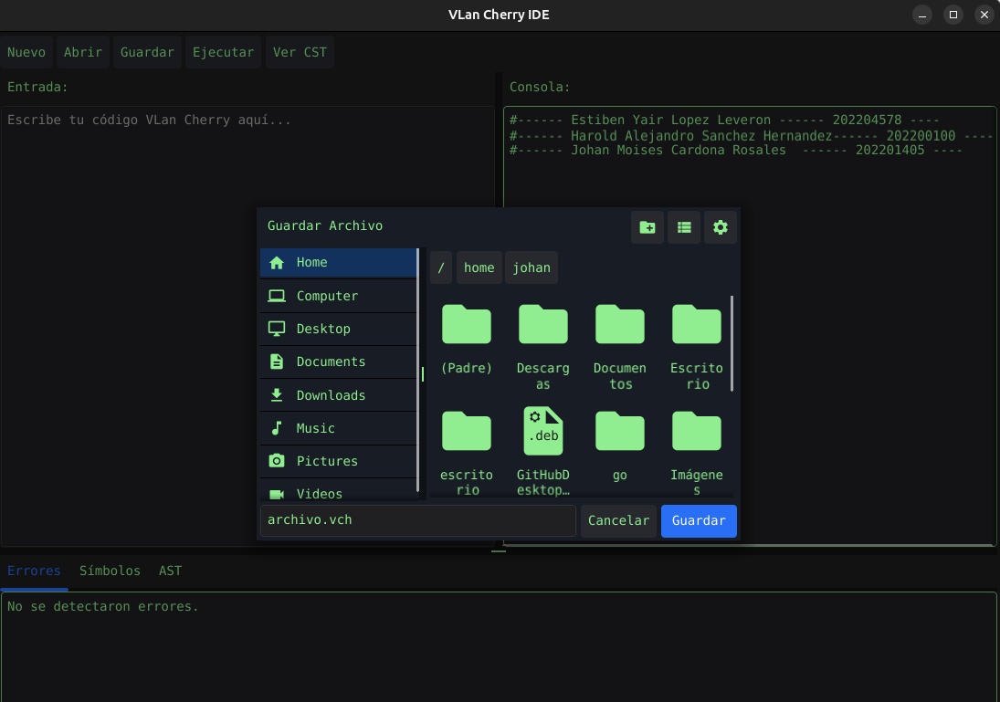
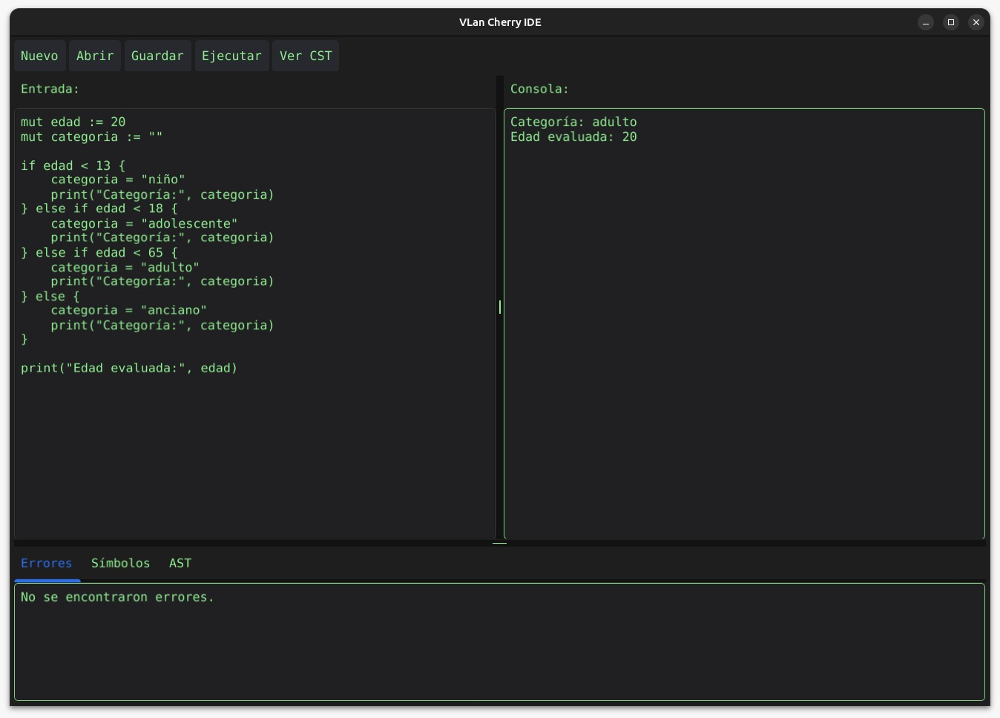
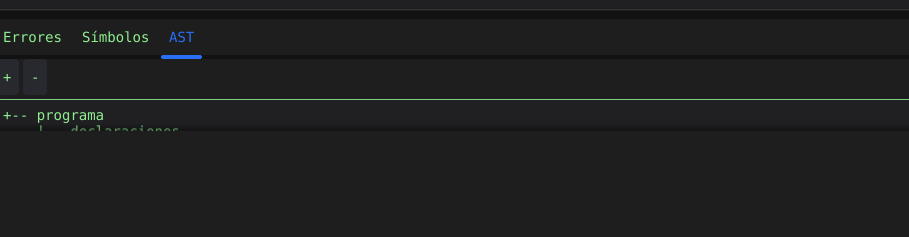

# Manual de Usuario - Proyecto #1 VLangCherry 

### Grupo 19
- Estiben Yair Lopez Leveron - 202204578
- Harold Alejandro Sánchez Hernández - 202200100
- Johan Moises Cardona Rosales - 202201405

## Índice

1. [Introducción](#introducción)  
2. [Requisitos del Sistema](#requisitos-del-sistema)  
3. [Instalación](#instalación)  
4. [Uso de la Aplicación](#uso-de-la-aplicación)  
   - [Interfaz Principal](#interfaz-principal)  
   - [Crear un Archivo](#crear-un-archivo)  
   - [Abrir un Archivo](#abrir-un-archivo)  
   - [Guardar un Archivo](#guardar-un-archivo)  
   - [Ejecutar Código](#ejecutar-código)  
5. [Visualización de Resultados](#visualización-de-resultados)  
   - [Consola](#consola)  
   - [Reporte de Errores](#reporte-de-errores)  
   - [Tabla de Símbolos](#tabla-de-símbolos)  
   - [Árbol de Sintaxis Abstracta (AST)](#árbol-de-sintaxis-abstracta-ast)  
6. [Ejemplos de Código](#ejemplos-de-código)  
7. [Consideraciones Generales](#consideraciones-generales)  
8. [Contacto y Soporte](#contacto-y-soporte)

---

## Introducción

VLangCherry es un entorno de desarrollo e interpretación para un lenguaje de programación educativo diseñado para comprender los principios de compiladores. Este manual tiene como objetivo guiar al usuario en el uso correcto de la aplicación.

---

## Requisitos del Sistema

### 1. Requisitos de Software

- Sistema operativo: **Linux**
- Lenguaje base: **Go**
- **ANTLR**
- **Node.js + npm**


### 2. Requisitos de Hardware
- Procesador (CPU): **1.6 GHz**
- Memoria RAM: **2GB**
- Espacio en Disco: **200mb**

### 3. Entornos 
- go version
- java -version
- node -v
- npm -v
- git --version


---

## Instalación

1. Clona el repositorio desde GitHub:

   ```bash
   git clone https://github.com/usuario/OLC2_Proyecto1_202204578.git
   ```
   
2. Accede al directorio del proyecto:

```bash
cd OLC2_Proyecto1_<carnet>  
```

3. Ejecuta el programa:
- Con Fyne:
```bash
go run main.go
```

## Uso de la Aplicación
#### Interfaz Principal
La interfaz cuenta con las siguientes secciones:

- Editor de texto (para escribir código .vch)

- Botones de acción: Crear, Abrir, Guardar, Ejecutar

- Consola: Muestra mensajes y resultados

- Área de reportes: Para ver errores, tabla de símbolos y AST




#### Funcionalidades

- **Abrir un Archivo:** Dará opción para seleccionar un archivo con extensión .vch.



- **Guardar un Archivo:** Almacenará el contenido, asegurarse de tener una extensión .vch



- **Ejecutar Código**
Esto inicia el análisis léxico, sintáctico y semántico. Si no hay errores, se mostrará el resultado de la ejecución en la consola.




- **Reporte de Errores**
Muestra una tabla con número de línea y columna, tipo de error: léxico, sintáctico o semántico.

- **Tabla de Símbolos**
Muestra variables, funciones, structs con: Nombre, Tipo, Ámbito, Línea y columna de declaración.

- **Árbol de Sintaxis Abstracta (AST)**
Representa jerárquicamente el flujo del código fuente.


