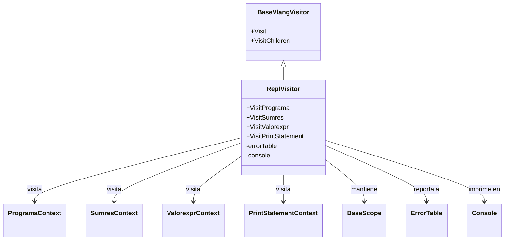

# What Next? 
Antes de empezar a leer esto, tienes que ver la clase de JUNIO 5 para entender el patrón Visitor. 
En este documento se ven algunos conceptos basados en eso. 

```bash 
Escribe el codigo de Vlang: (Ctrl+D) para terminar
3 + 5 * (2 - 1)
Se termino el analisis sintactico
+-- programa
    |-- expresion
    |   |-- expresion
    |   |   +-- valores
    |   |       +-- valor
    |   |           +-- "3"
    |   |-- "+"
    |   +-- expresion
    |       |-- expresion
    |       |   +-- valores
    |       |       +-- valor
    |       |           +-- "5"
    |       |-- "*"
    |       +-- expresion
    |           |-- "("
    |           |-- expresion
    |           |   |-- expresion
    |           |   |   +-- valores
    |           |   |       +-- valor
    |           |   |           +-- "2"
    |           |   |-- "-"
    |           |   +-- expresion
    |           |       +-- valores
    |           |           +-- valor
    |           |               +-- "1"
    |           +-- ")"
    +-- "<EOF>"
```
Agregue un metodo para generar este arbol cada vez que probamos la estructura.


## Se que existe el Visitor pero...¿Ahora qué? 

Lo primero es que debemos hacer un visitor por las operaciones que queremos hacer, en este caso,  interpretar. Por lo que, a partir de esta gramatica, si nos vamos a la carpeta `/parser` notaremos que en `vlang_visitor.go` y en  `base_visitor.go` 
estaran los metodos que nos proponen la interfaz del Visitor y la clase abstracta.
Debes copiar estos métodos a un archivo en el que quieras para declarar un visitor 
que extienda de la interfaz de `visitor` que propones. 

### Creacion de un visitor 
En la carpeta `repl` 
podemos encontrar estos archivos
```Bash 
├── argument.go
├── console.go
├── error_table.go
├── repl.go
├── scope.go
├── variable.go
└── visitor.go
```
de momento utilizaremos `visitor.go` para crear nuestro visitor.  


En Go, las interfaces son definidas de una manera distinta a la usual. 
En este caso, solamente heredaremos de la clase que nos provee los métodos. 
```Go 

```
Obviamente al definir nuestra clase de visitor tenemos que obedecer 
orientacion a objetos. Así que necesitamos 
- Un constructor
```Go 
func NewReplVisitor() *ReplVisitor {
	return &ReplVisitor{}
}
```
Recordemos que desde `main` llamamos `visitor.visit(arbolito)`
por lo que debemos implementar ese metodo tambien. 
```Go
func (v *ReplVisitor) Visit(tree antlr.ParseTree) interface{} {

	switch val := tree.(type) { 
	case *antlr.ErrorNodeImpl:
		log.Fatal(val.GetText())
		return nil
	default:
		return tree.Accept(v) <---- devolvemos el metodo recursivo que nos da el arbol
	}

}
```
Si buscamos `Accept` en el archivo `vlang_parser.go` notaremos que 
todas nuestras reglas tienen el método para regresar de manera recursiva a
este proceso. 


## Muy bien, ahora podemos empezar a hacer nuestros metodos
recordemos que los metodos estan basados en cada una de las reglas


Lo que debemos hacer es copiar el metodo que nos provee la `base_visitor.go` e implementarlo en nuestro `visitor.go`

Si abrimos `parser/vlang_base_visitor.go`
podemos encontrar todas las reglas asociadas en la clase abstracta 
```Go
type BaseVlangVisitor struct {
	*antlr.BaseParseTreeVisitor
}
```
Lo unico que debemos cambiar es 
la clase a la que se encuentra asociada a lo que queremos hacer e implementarlo. ¿Cómo? copiamos la funcion visit que necesitemos, si necesitamos implementar la funcionalidad del nodo `Programa`
en nuestra gramatica. 
```Bash 
// === Axioma principal ===
programa : declaraciones* EOF ;
declaraciones : varDcl   
              | stmt    
              ; 
```
Pues copiamos la funcion
```Go 
func (v *BaseVlangVisitor) VisitPrograma(ctx *ProgramaContext) interface{} {
	return v.VisitChildren(ctx)
}
```
y la implementaremos en `visitor.go`
copiamos pero, obviamente si ponemos la funcion en otra clase, debemos asociarlo al `struct` de `ReplVisitor`
```Go
func (v *BaseVlangVisitor) 
                 ^
                 |
    Cambiamos esto por ReplVisitor

VisitPrograma(ctx *ProgramaContext)
                        ^
                        | 
        Cambiamos por parser.ProgramaContext

interface{} {
	return v.VisitChildren(ctx)
}
```
Nota: Depende de que paquete le hayas dado a tus archivos en `/parser`
```Go


func (v *)
       ^ 
       | 
       | 
Cambiar BaseVisitor 
por el nombre de nuestra 
clase ReplVisitor. 
```

